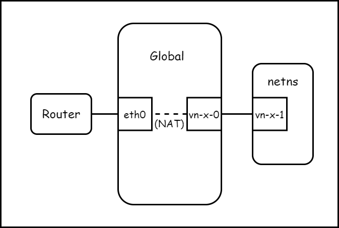
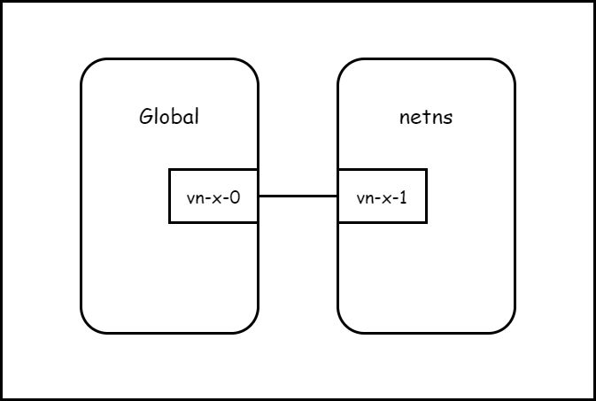

# systemd-named-netns

This project enables you to:
 * Create and delete named netns on the fly like systemd services
 * Start named netns on boot
 * Quickly set up bridging or NAT from netns to host
 * Use named netns in systemd services
   * Enables them to connect to the internet too
   * And you can manually switch to its netns (since they are named)

## Installation

Dependencies:
 * Recent version of systemd (newer is better; tested down to v232)
 * iproute2
 * iptables (only if you use default NAT config)
 * `/usr/bin/env`

For installation, run `make install` with root privilege.

You ran run `make uninstall` to remove the systemd units, but the configs located in `/etc/default` will not be removed.

## Quickstart

```shell
systemctl start netns-nat@helloworld
chnetns helloworld ip address
```

## NS Types

### Basic (`netns@.service`)

It creates a new netns. Use this if you want to customize everything by hand. All other types depend on this. 


### NAT (`netns-nat@.service`)

It creates a new netns with NATed network access (like VMNet8). Use this if you want to get things quickly up and running without any network hassles. 

Note:

* The default configuration will only work for the first `netns-nat` instance. You need to change the IP addresses if you want 2 or more `netns-nat` instances running at the same time.
* This will setup packet forwarding on your Linux kernel, making your host a router (this might cause security problems if set incorrectly)
* If you want automatic iptables accept rules, set `NAT_ACCEPT_TRAFFIC=1`



### Tunnel (`netns-tunnel@.service`)

It creates a new netns with a pseudo wire to the host (like VMNet1). Use this if you want to communicate with the program inside the netns but don't want them to have internet access, or if you want to assign routable IPs to a netns.



### Bridge (`netns-bridge@.service`)

It bridges the new netns to a Linux bridge. You need to set up the bridge first: see [wiki](https://github.com/Jamesits/systemd-named-netns/wiki/Bridging) if you are not sure what to do.


### MACVLAN Bridge (`netns-mvbr@.service`)

Alternative to NSType bridge. A [MACVLAN Bridge](https://developers.redhat.com/blog/2018/10/22/introduction-to-linux-interfaces-for-virtual-networking/#macvlan) allows you to create multiple interfaces with different Layer 2 (that is, Ethernet MAC) addresses on top of a single NIC. MACVLAN is a bridge without an explicit bridge device. 

For netns-mvbr, `${MACVLAN_BRIDGE}` will be the bridge device (usually your physical NIC device).

Note that any MACVLAN devices in other netns's will be able to communicate each other and the outside world but NOT the bridge device. If you want to enable communication with the root netns, you can add a MACVLAN device in the root netns and use that instead of the MACVLAN bridge device.

## Resources

 * [Create and Delete Netns](https://github.com/Jamesits/systemd-named-netns/wiki/Create-and-Delete-Netns)
 * [Switch to some netns and run program](https://github.com/Jamesits/systemd-named-netns/wiki/Chnetns)
 * [Put a systemd unit(service) into a netns](https://github.com/Jamesits/systemd-named-netns/wiki/Systemd-Units-and-Netns)
 * [Configuration](https://github.com/Jamesits/systemd-named-netns/wiki/Config)
 * Use Cases
   * [2 programs listening on the same port](https://github.com/Jamesits/systemd-named-netns/wiki/Use-Case:-Listen-Port-Collision)
   * [Bypass full tunneling VPN](https://github.com/Jamesits/systemd-named-netns/wiki/Use-Case:-OpenConnect-Full-Tunneling-VPN-and-LAN-Access)

## References

 * [f3flight/openconnect-ns](https://github.com/f3flight/openconnect-ns)
 * [@dechamps's netns@.service](https://github.com/systemd/systemd/issues/2741#issuecomment-336736214)
 * [systemd.service](https://www.freedesktop.org/software/systemd/man/systemd.service.html)
 * [systemd.unit](https://www.freedesktop.org/software/systemd/man/systemd.unit.html)
